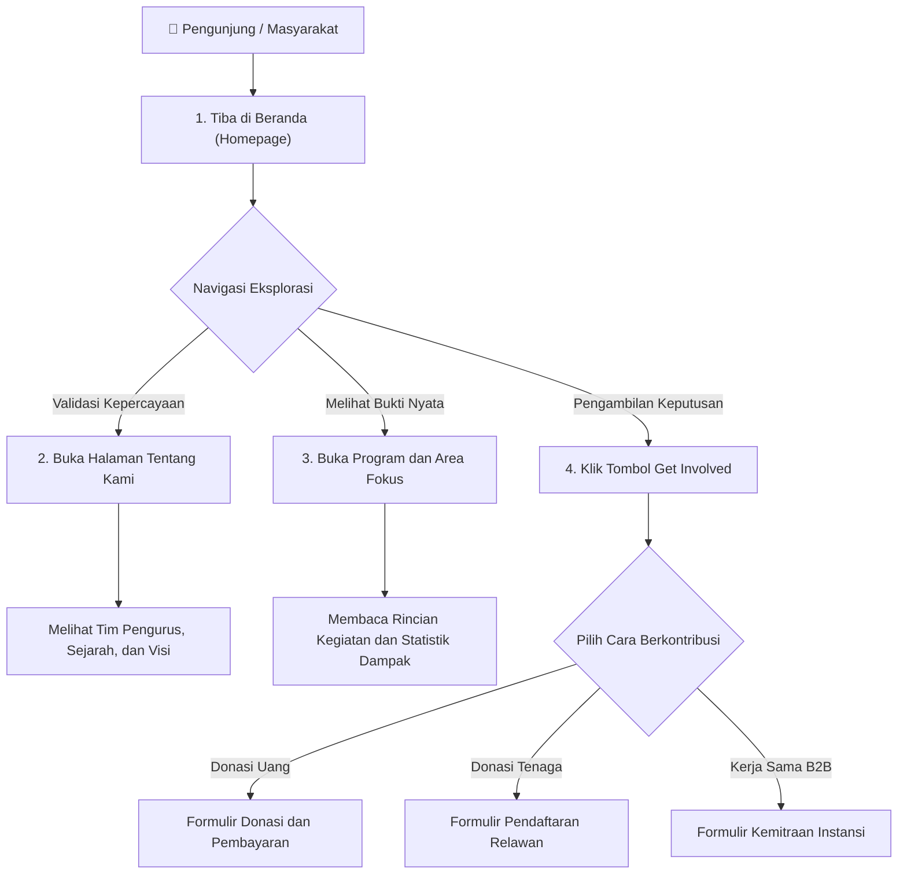
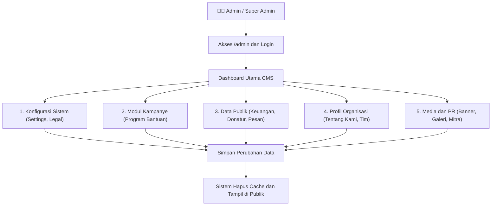
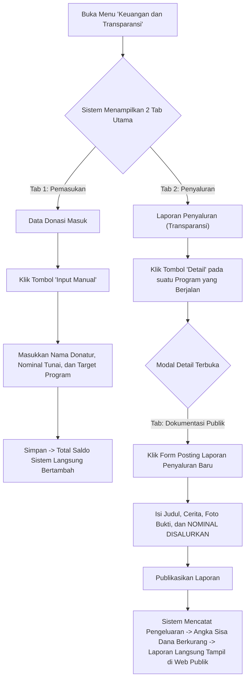
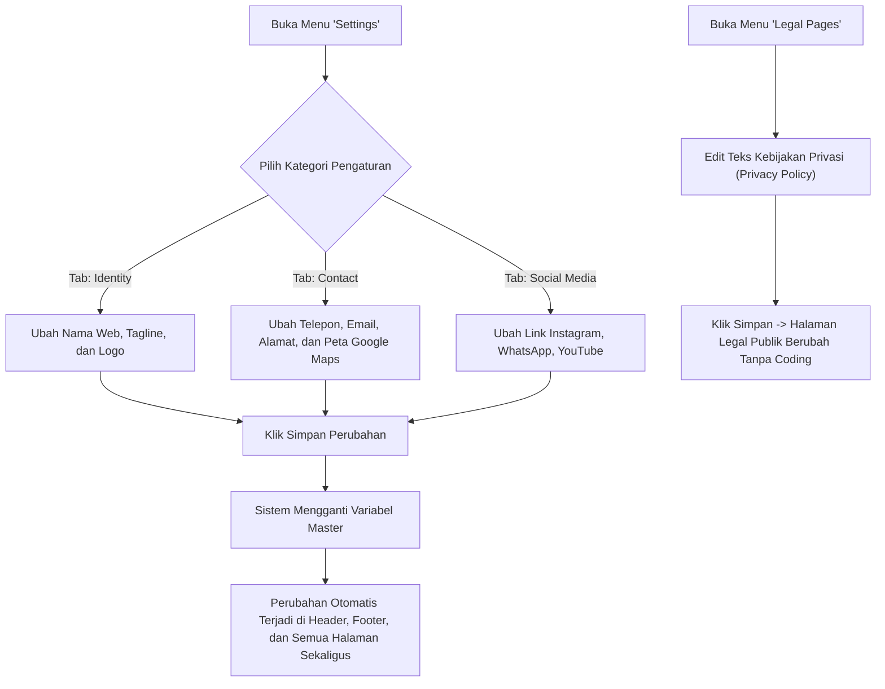
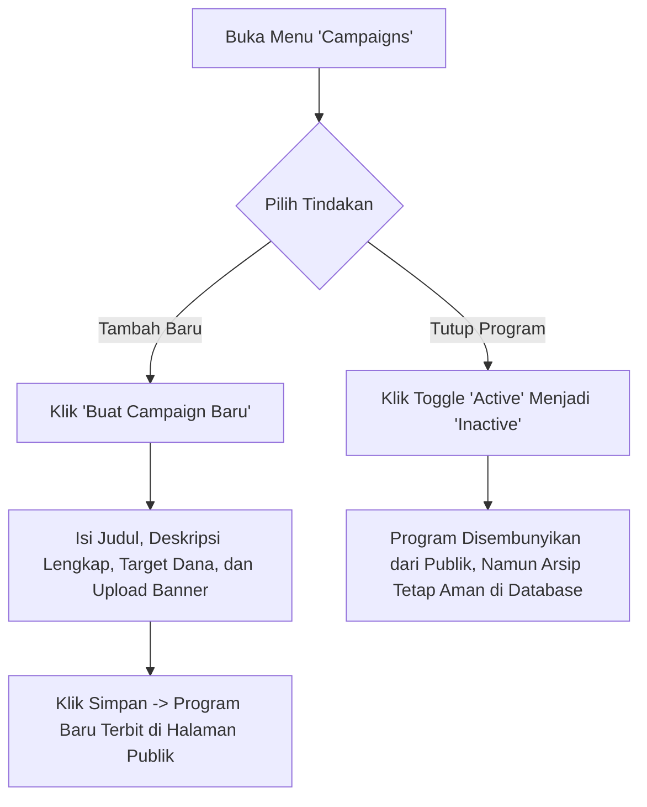
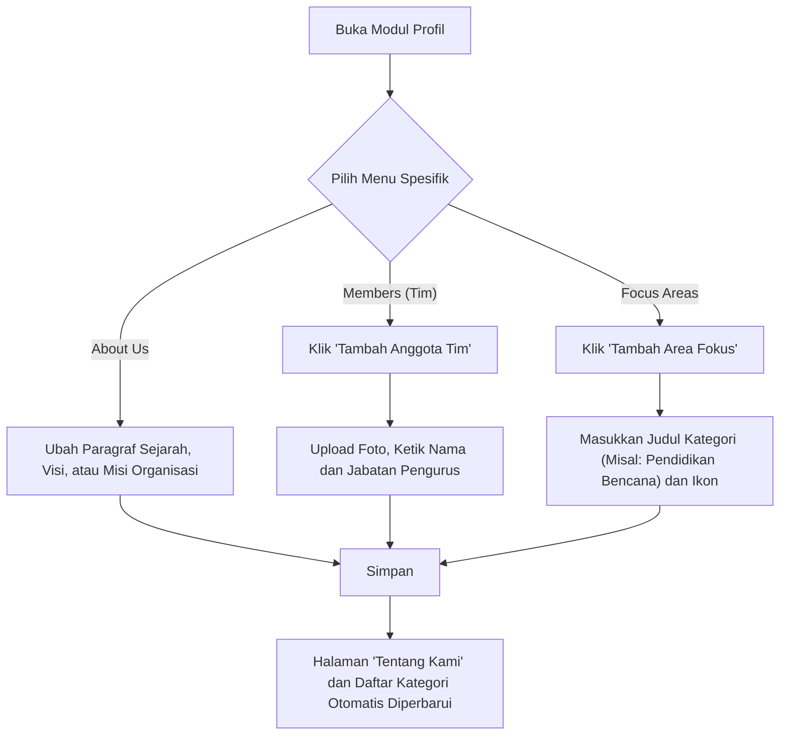
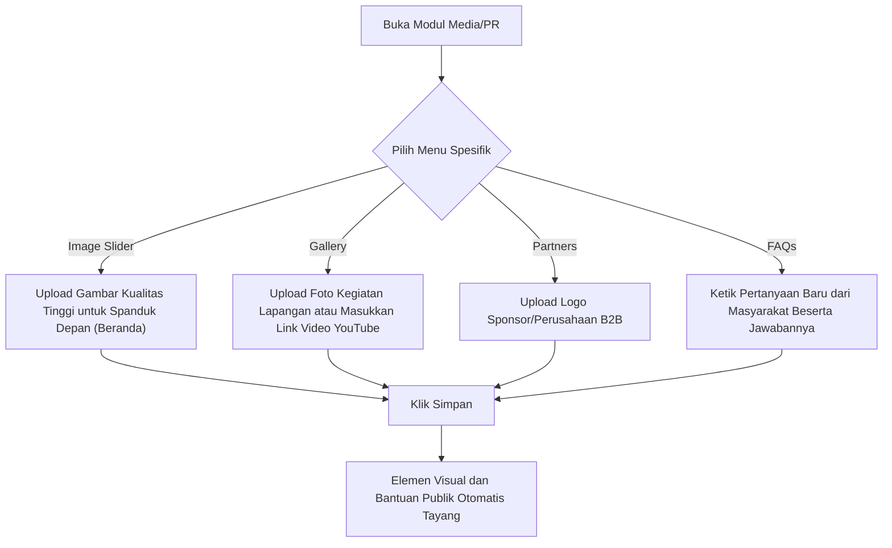
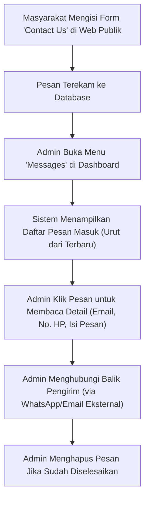
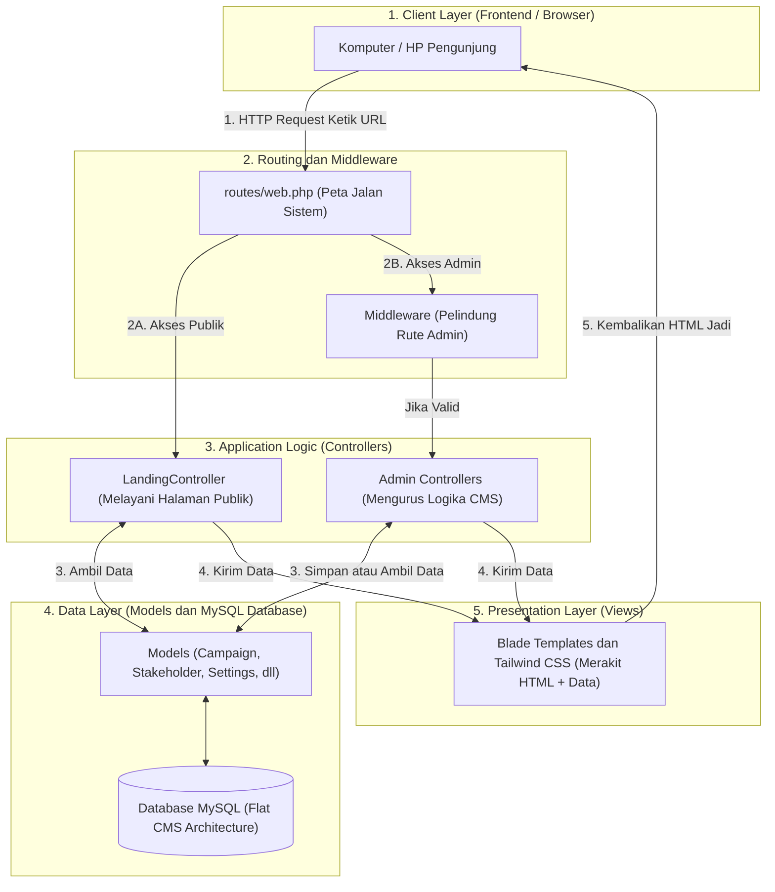

# 📚 MASTER DOKUMEN: Referensi Lengkap Sistem Fundunity

> [!NOTE]
> **Dokumen Induk (Master Document)** ini merangkum seluruh aspek dari platform Fundunity. Di dalamnya terdapat Alur Global, Detail Alur untuk SEMUA Modul Admin, **Penjelasan Teknis Lengkap**, serta ditutup dengan **Script Video Tutorial / Manual Book** (Bab 6) untuk panduan operasional.

---

## 1. 📖 Gambaran Umum Platform (Apa Itu Fundunity?)

**Fundunity (Komunitas Ruang Berbagi)** adalah aplikasi web yang menjembatani donatur, relawan, dan institusi dengan masyarakat yang membutuhkan bantuan. 

Sistem ini memiliki dua peran utama:
1. **Sisi User / Publik:** Berfokus pada visual yang menarik, transparan, dan persuasif agar masyarakat tergerak menyumbang atau menjadi relawan.
2. **Sisi Admin / CMS:** Panel kontrol pengurus untuk mengubah gambar, teks, dan laporan donasi secara instan (real-time) tanpa *coding*.

---

## 2. 🧑 Alur Pengguna: Bagaimana Masyarakat Menggunakan Website Ini?

---

## 3. 👨‍💼 Alur Administrator Utama (Admin Global Flow)

Berikut adalah ringkasan gambaran besar panel admin secara keseluruhan. (Detail setiap cabangnya dibedah di Bab 4).

---

## 4. 🔍 DETAIL ALUR SEMUA MODUL ADMIN

### A. Alur Modul Keuangan dan Transparansi
Di sini admin membuktikan ke publik ke mana uang donasi disalurkan.

### B. Alur Konfigurasi Identitas Website (Settings & Legal)

### C. Alur Manajemen Kampanye (Programs)

### D. Alur Profil Organisasi (About Us, Tim, Focus Areas)

### E. Alur Media & Relasi Publik (Banner, Galeri, Partner, FAQ)

### F. Alur Interaksi Publik (Inbox Pesan)

---

## 5. ⚙️ Penjelasan Teknis dan Arsitektur Sistem (Developer Section)

Sistem Fundunity dibangun di atas pondasi **Framework Laravel 12**. Pendekatan arsitekturnya menggunakan **Model-View-Controller (MVC)** yang memisahkan logika data dengan tampilan layar.

### A. Alat dan Teknologi Pendukung (Tech Stack):
1. **Laravel 12 (PHP 8.2):** *Backend framework* yang mengatur logika, keamanan (login/reset sandi), dan rute.
2. **Tailwind CSS:** *Framework* desain (CSS) modern yang membuat web responsif di HP maupun Laptop.
3. **Blade Template Engine:** Mesin perakit tampilan milik Laravel.
4. **Vite:** *Asset bundler* yang mempercepat pemuatan halaman web.
5. **Laravel Breeze:** Menangani sistem otentikasi.

### B. Konsep "Flat CMS" (Kunci Keamanan Database)
Struktur database Fundunity sengaja dibuat **tanpa relasi yang mengikat ketat (No Foreign Keys)**. 
- **Keuntungan (Cascade Safe):** Jika admin salah menghapus data di menu `FAQs`, halaman `About Us` atau `Programs` tidak akan ikut rusak secara beruntun (*cascade error*).
- **Zero Downtime:** Karena sistem CMS tidak mengandalkan relasi tabel yang berat, website memuat data jauh lebih cepat dibantu dengan pembersihan memori (*Auto-Clear Cache*) saat admin menekan tombol Simpan.

---

## 6. 🎬 SCRIPT VIDEO: Manual Book Panduan Penggunaan Fundunity

> [!TIP]
> Script di bawah ini dirancang murni sebagai **Video Tutorial (Buku Manual Visual)**. Nada penyampaian harus jelas, informatif, dan tahap-demi-tahap (Step-by-Step). Narator mengarahkan penonton langsung ke tombol yang harus diklik.

| Bagian | Layar / Rekaman Kursor (Screen Record) | Panduan Suara (Voice Over Narator) |
| :--- | :--- | :--- |
| **I. Pendahuluan & Sisi Publik** (00:00 - 00:30) | Buka halaman *Home*. Kursor mengarah ke menu *About Us*, lalu ke halaman *Programs*.   Kursor mengklik salah satu program yang sedang berjalan.   Kursor menekan tombol **Get Involved** dan menyorot tiga form: Donasi, Relawan, dan Kemitraan. | "Halo, selamat datang di panduan sistem Fundunity.   Bagi pengunjung publik, website ini sangat mudah diakses. Menu 'Tentang Kami' memuat profil lembaga, sementara menu 'Program' menampilkan daftar kegiatan yang sedang berjalan.   Untuk bergabung, pengunjung cukup menekan tombol 'Get Involved' lalu memilih ingin berdonasi uang, mendaftar sebagai relawan, atau mengajukan kemitraan B2B." |
| **II. Login ke Panel Admin** (00:30 - 01:00) | Buka tab baru, ketik URL `website.com/admin`.   Masukkan email dan kata sandi. Tekan 'Login'.   Layar menampilkan *Dashboard* utama dengan statistik Donasi. | "Sekarang mari beralih ke sisi Administrator.   Untuk mengelola website, tambahkan kata garis miring 'admin' di akhir alamat website Anda. Masukkan email dan sandi yang telah didaftarkan.   Setelah berhasil masuk, Anda akan disambut oleh Dashboard yang menampilkan ringkasan data donasi dan status sistem." |
| **III. Mengatur Identitas Website** (01:00 - 01:30) | Di *sidebar* kiri, klik menu **Settings**.   Pilih tab **Contact**, ubah nomor WhatsApp.   Pilih tab **Identity**, ubah nama web. Klik tombol **Save**.   Buka kembali tab web publik untuk melihat perubahannya. | "Untuk mengganti informasi kontak, buka menu 'Settings' di bilah sisi kiri.   Di dalam menu ini, Anda bisa mengubah Nomor WhatsApp, Email, Link Sosial Media, hingga Logo Lembaga. Masukkan informasi baru, lalu tekan tombol 'Simpan'.   Sistem otomatis memperbarui seluruh informasi ini di halaman depan, header, dan footer." |
| **IV. Mengelola Program Kampanye** (01:30 - 02:00) | Klik menu **Campaigns** di *sidebar*.   Klik tombol **Buat Baru**. Isi form: Judul, Target Rupiah, Deskripsi, dan unggah *cover image*.   Klik tombol *Toggle Active* di salah satu tabel program untuk mematikannya. | "Selanjutnya, menu 'Campaigns'. Ini adalah tempat Anda membuat program penggalangan dana baru.   Cukup klik 'Buat Baru', isi judul program, target pengumpulan dana, dan unggah fotonya.   Jika program sudah selesai, Anda cukup menekan tombol saklar 'Aktif' agar statusnya nonaktif dan menghilang dari beranda publik." |
| **V. Pelaporan Keuangan (Transparansi)** (02:00 - 02:40) | Klik menu **Keuangan & Transparansi**.   Masuk ke Tab **Laporan Penyaluran**, klik tombol **Detail** pada salah satu program.   Pindah ke tab **Dokumentasi Publik**, isi judul laporan, unggah foto, dan masukkan **nominal uang**. Tekan Simpan. | "Fitur terpenting ada di menu 'Keuangan dan Transparansi'.   Untuk melaporkan uang yang sudah dipakai, masuk ke Tab Laporan Penyaluran, lalu klik 'Detail' pada program yang Anda tuju.   Pilih tab Dokumentasi Publik. Di sini, masukkan judul kegiatan, unggah bukti foto, dan ketik nominal uang yang telah disalurkan. Saat Anda klik publikasikan, saldo sisa donasi di halaman depan akan otomatis terpotong." |
| **VI. Mengelola Interaksi Publik** (02:40 - 03:00) | Klik menu **Messages**. Kursor menyorot tabel berisi daftar pertanyaan pengunjung.   Klik tombol 'Hapus' pada pesan yang sudah dibalas. | "Terakhir, fitur 'Messages'.   Semua pertanyaan dari form kontak di website akan tersimpan dengan aman di menu ini. Anda bisa melihat nomor telepon pengunjung dan menghubungi mereka secara eksternal.   Sistem ini memastikan tidak ada keluhan yang terlewatkan. Sekian panduan operasional Fundunity." |
